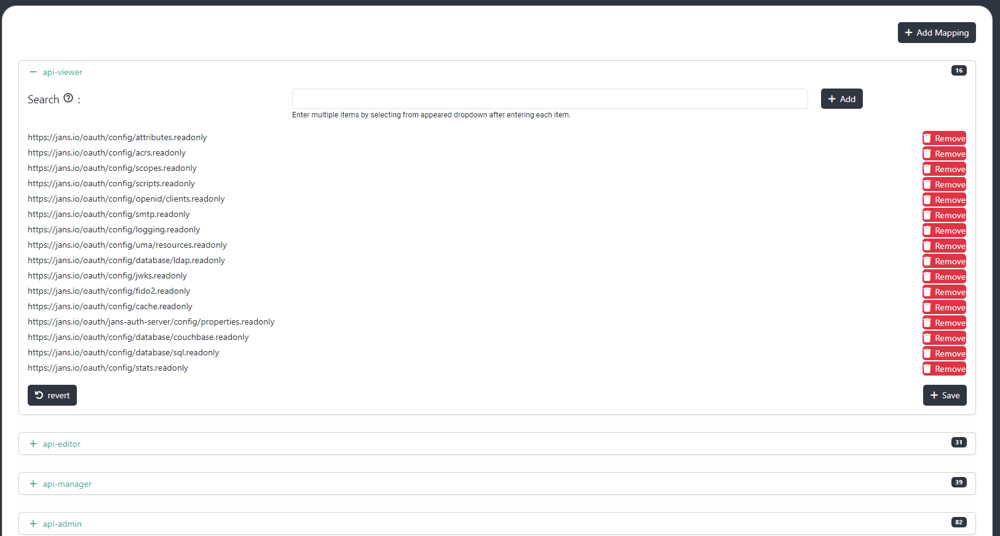

## Admin UI Role

The logged-in administrator can create, edit or destroy an Admin UI Role using the `Admin UI Roles` Page. The created Admin UI Role can be assigned to the user using the User Management feature of this GUI. After installation, the following Roles can be seen on Admin UI: api-viewer, api-editor, api-manager and api-admin. The default user of Admin UI i.e. `admin` is assigned with api-admin. A user with one or more Admin UI role assigned will be able to login to this user interface.

## Permissions (Scopes)

Admin UI uses Config API (jans-config-api) to manage and configure the Jans Auth server. Config API helps in configuring auth-server, users, fido2 and scim modules. The APIs of this rest application are protected using an authorization token containing the appropriate permissions (scopes). Admin UI has the feature to add, edit and delete the permissions used to access the APIs which are used by Admin UI.

## Role-Permission Mapping

The administrator can map the Admin UI roles with one or more permissions using the Role-Permission Mapping page. The role(s) mapped with permissions can be then assigned to the user to allow access to the corresponding pages and features of the GUI.

